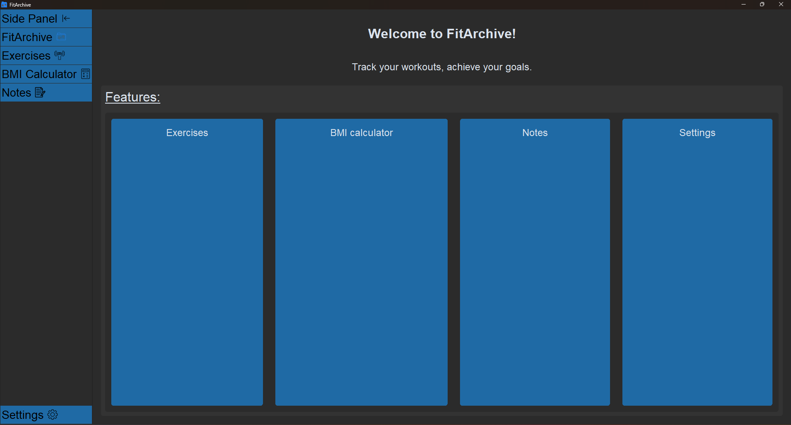

# FitArchive

Pre-development:

This is my personal workout tracker that uses pandas for data manipulation of the csv collection of my workouts and their respective PRs

By the end the app should:

- allow me to add new workouts and the records
- have a functional GUI
- visualise the target muscles using a diagram
- offer different ways of visualising my progress (bar charts, pie charts, graphs, etc.)

The Pyinstaller command used to compile the code (you need to have the modules/libraries installed):

pyinstaller --windowed --hidden-import=pandas._libs.tslibs.base --hidden-import=PIL --add-data="C:\Users\<user>\AppData\Local\Programs\Python\Python313\Lib\site-packages;pillow" --add-data="C:\Users\<user>\AppData\Local\Programs\Python\Python313\Lib\site-packages;customtkinter" --add-data="C:\Users\<user>\AppData\Local\Programs\Python\Python313\Lib\site-packages;seaborn" -n FitArchive .\app.py

Post development:

FitArchive was made by myself (Xorpax) as a workout tracker.

- The app allows you to add exercises, their data and track your progress using the visualise function!
- FitArchive includes a notes section where you have no size limit, as opposed to the 200 characters exercise note limit.
- There is a selection of colour schemes used for the GUI, thanks to a13xe (https://github.com/a13xe/CTkThemesPack). 
- Each scheme has its dark and light theme. Those are stored as .json files, making them entirely configurable!
- The BMI calculator feature uses metric units and presents users with an index of weight classes based on the BMI score.

# Landing Page

# Exercises Panel

# Exercise Data

# BMI Calculator

# Exercises Panel

# Autumn Light Theme

# Lavender Light Theme

Do not hesitate to contact me through my discord (kyloren6933) if you have any questions/feedback!